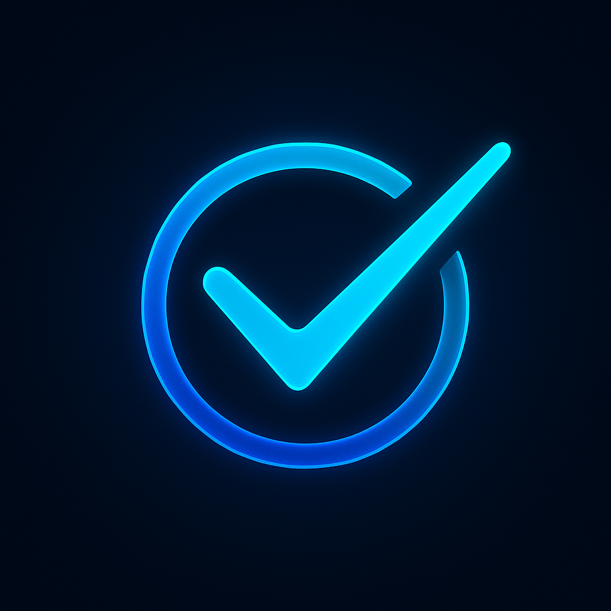

<!-- Improved compatibility of back to top link: See: https://github.com/othneildrew/Best-README-Template/pull/73 -->
<a id="readme-top"></a>

[![LinkedIn][linkedin-shield]][linkedin-url]


<!-- PROJECT LOGO -->
<br />
<div align="center">
  <a href="https://github.com/Gukodah/Gukodah-hubxp-fullstack-challenge">
    
  </a>

  <h3 align="center">HubXP Tasks App</h3>

  <p align="center">
    A Tasks Management App
    <br />
    <a href="https://github.com/othneildrew/Best-README-Template">View Demo</a>
    &middot;
    <a href="https://github.com/othneildrew/Best-README-Template/issues/new?labels=bug&template=bug-report---.md">Report Bug</a>
    &middot;
    <a href="https://github.com/othneildrew/Best-README-Template/issues/new?labels=enhancement&template=feature-request---.md">Request Feature</a>
  </p>
</div>


<!-- TABLE OF CONTENTS -->
<details>
  <summary>Table of Contents</summary>
  <ol>
    <li>
      <a href="#about-the-project">About The Project</a>
      <ul>
        <li><a href="#built-with">Built With</a></li>
      </ul>
    </li>
    <li>
      <a href="#getting-started">Getting Started</a>
      <ul>
        <li><a href="#prerequisites">Prerequisites</a></li>
        <li><a href="#installation">Installation</a></li>
      </ul>
    </li>
    <li><a href="#usage">Usage</a></li>
    <li><a href="#roadmap">Roadmap</a></li>
    <li><a href="#contributing">Contributing</a></li>
    <li><a href="#license">License</a></li>
    <li><a href="#contact">Contact</a></li>
    <li><a href="#acknowledgments">Acknowledgments</a></li>
  </ol>
</details>


<!-- ABOUT THE PROJECT -->
## About The Project

[![Product Name Screen Shot][product-screenshot]](https://example.com)


Below you can find all the information regarding the technical choices I made during the development of this project as well as the instructions for executing it.

<p align="right">(<a href="#readme-top">back to top</a>)</p>


### Built With

This section should list any major frameworks/libraries used on this project.

* [![Next][Next.js]][Next-url]

<p align="right">(<a href="#readme-top">back to top</a>)</p>


<!-- GETTING STARTED -->
## Getting Started

Instructions on setting up your project locally.
To get a local copy up and running follow these simple example steps.

### Prerequisites

- You will need some Docker Engine available to execute the application containers locally.
(Hint: During the development process i've used the Linux/Debian Docker Engine with command line interface to manage it.)

### Installation

_Below is an example of how you can instruct your audience on installing and setting up your app. This template doesn't rely on any external dependencies or services._

1. Get a free API Key at [https://example.com](https://example.com)
2. Clone the repo
   ```sh
   git clone https://github.com/github_username/repo_name.git
   ```
3. Install NPM packages
   ```sh
   npm install
   ```
4. Enter your API in `config.js`
   ```js
   const API_KEY = 'ENTER YOUR API';
   ```
5. Change git remote url to avoid accidental pushes to base project
   ```sh
   git remote set-url origin github_username/repo_name
   git remote -v # confirm the changes
   ```

<p align="right">(<a href="#readme-top">back to top</a>)</p>


<!-- USAGE EXAMPLES -->
## Usage

Use this space to show useful examples of how a project can be used. Additional screenshots, code examples and demos work well in this space. You may also link to more resources.

_For more examples, please refer to the [Documentation](https://example.com)_

<p align="right">(<a href="#readme-top">back to top</a>)</p>


## Journal of Development Process

Here i will register all my major steps related to how i've thinked about the development process.

### Front-end

1 - I've started planning some basic UI that could handle all the bussiness requirements.

<div align="center">
    
</div>


### Back-end

1 - I've started planning, it means giving a first sight over i will be able to write my DDL (Data Definition Language) and HTTP interface
considering my technology stack limitations (Python-Django, Next.js, PostgreSQL)
After a first look over the available options, i've considered two main paths, write the DDL on a .sql file or use some kind of ORM to define the data models using
Python scripts.
I've Optated by the second one (write DDL through .py files and some ORM)
It will give me more flexibility during the development process, i will be able to work with migrations that provides to my app more reliability and the special
ability to undo database structure change.


### Devops

1 - I've started deciding which services would I add to my docker-compose.yml file.
I prefer to start simple, with one service for each important chunk of the solution, it means:

  <strong>postgres:</strong> Container concerned on the execution of the postgresSQL database
  
  <strong>pgadmin:</strong> Container concerned on the execution of a tool that turns the processes of manage the databases more easily, not is required but could be usefull and speed up the development process.

   <strong>server:</strong> Container concerned on the execution of the Python/Django back-end application wich will be responsible to contains majority of our bussines rules and datasource access.

   <strong>client:</strong> Container concerned on the execution of the Next.js front-end application, wich will be responsible to build and provide access to our front-end bundle.

As soon as possible i plan to add some special containers that will be used to handle the development steps requriments like hot roload and debug modes.


