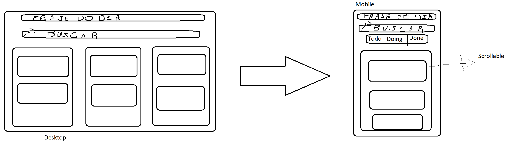
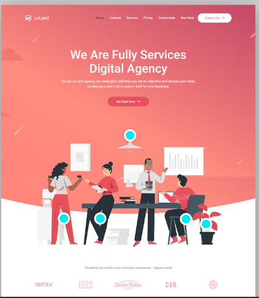

<!-- Improved compatibility of back to top link: See: https://github.com/othneildrew/Best-README-Template/pull/73 -->
<a id="readme-top"></a>

<!-- PROJECT LOGO -->
<br />
<div align="center">
  <a href="https://github.com/Gukodah/Gukodah-hubxp-fullstack-challenge">
    
  </a>

  <h3 align="center">HubXP Tasks App</h3>

  <p align="center">
    A Tasks Management App
    <br />
    <a href="https://github.com/othneildrew/Best-README-Template">View Demo</a>
    &middot;
    <a href="https://github.com/othneildrew/Best-README-Template/issues/new?labels=bug&template=bug-report---.md">Report Bug</a>
    &middot;
    <a href="https://github.com/othneildrew/Best-README-Template/issues/new?labels=enhancement&template=feature-request---.md">Request Feature</a>
  </p>
</div>


<!-- TABLE OF CONTENTS -->
<details>
  <summary>Table of Contents</summary>
  <ol>
    <li>
      <a href="#about-the-project">About The Project</a>
      <ul>
        <li><a href="#built-with">Built With</a></li>
      </ul>
    </li>
    <li>
      <a href="#getting-started">Getting Started</a>
      <ul>
        <li><a href="#prerequisites">Prerequisites</a></li>
        <li><a href="#installation">Installation</a></li>
      </ul>
    </li>
    <li><a href="#usage">Usage</a></li>
    <li><a href="#roadmap">Roadmap</a></li>
    <li><a href="#contributing">Contributing</a></li>
    <li><a href="#license">License</a></li>
    <li><a href="#contact">Contact</a></li>
    <li><a href="#acknowledgments">Acknowledgments</a></li>
  </ol>
</details>

<!-- ABOUT THE PROJECT -->
## About The Project

Below you can find all the information regarding the technical choices I made during the development of this project as well as the instructions for executing it.

<p align="right">(<a href="#readme-top">back to top</a>)</p>

### Built With

This section should list any major frameworks/libraries used on this project.

* Next.js
* Python - DRF (Django Rest Framework)
* Redux

<p align="right">(<a href="#readme-top">back to top</a>)</p>

<!-- GETTING STARTED -->
## Getting Started

Instructions on setting up your project locally.
To get a local copy up and running follow these simple example steps.

### Prerequisites

- You will need some Docker Engine available to execute the application containers locally.
(Hint: During the development process i've used the Linux/Ubuntu Docker Engine with command line interface to interaction.)

### Installation

1. Clone the repo
   ```sh
   git clone https://github.com/Gukodah/Gukodah-hubxp-fullstack-challenge
   ```

2. Starts all docker services
   ```sh
    docker-compose up --build
    # Maybe your docker compose installation could be newer than mine so you could run like that:
    docker compose up --build
   ```
<p align="right">(<a href="#readme-top">back to top</a>)</p>


<!-- USAGE EXAMPLES -->
## Usage

Use this space to show useful examples of how a project can be used. Additional screenshots, code examples and demos work well in this space. You may also link to more resources.

_For more examples, please refer to the [Documentation](https://example.com)_

<p align="right">(<a href="#readme-top">back to top</a>)</p>


## Journal of Development Process - Day 1

Here i will register all my major steps related to how i've thinked AND did about the development process DURING THE FIRST DEVELOPMENT DAY.

### Front-end

-> I will use a tool called V0 to reduce the development time related to frontend code.

#### 1 - I've started planning some basic UI that could handle all the bussiness requirements.

<div align="center">
    
</div>

#### 2 - After it i decided wich other pages i will add on it:

  ##### 2.1 Landing Page

  This page will cotain some atractive elements and details about the product. It will be used to display all the product functionalities.
  Initially i will add some placeholder content to it.

  After some search over the internet i've found some great examples like this one:
    
  <div align="center">
      
  </div>

  So i just provide this to GPT with some some instructions and my color pallete to get a great "my version" of it and do some manually changes and its done. 

  ##### 2.2 Login Page

  For this one i just have copied the styles of the generated landing page and add a ultra basic layout for a simple form with fields.

  ##### 2.3 Register Page

  Re-use of the Login page and edit the form fields.

  ##### 2.4 Analytics Page

  I've used the charts that already comes with the ShadCN UI and just apply some color changes and other CSS properties changes to them through TailwindCSS overrides.

  ##### 2.5 Filter Page

  Re-use of the analytics page with some small changes.

#### 3 - Deciding about color schemes and themes. Aesthetics that will shape the design orientation

  ##### 3.1 First of all i have decided to use this icon of a great game that i'm playing, it calls: The Surge.
  
  <div align="center">
    
  </div>

  I've droped it's logo on a color picker app and extract the following colors

  <strong> Cyan/Aqua - Main accent color </strong>
  
  ```css 
  --cyan-400: #22d3ee
  --cyan-500: #06b6d4
  --cyan-600: #0891b2
  ```

  <strong> Blue - Secondary accent </strong>
  
  ```css
  --blue-400: #60a5fa
  --blue-500: #3b82f6
  --blue-600: #2563eb
  --blue-900: #1e3a8a
  ```

After it i've used GPT to help me to compose my color pallete focusing on TailwindCSS v3 helper format.
I've reached on these results after some chating:

### **Dark backgrounds** 

  ```css
  /* Success/Completed */
  --slate-900: #0f172a
  --slate-800: #1e293b
  --slate-700: #334155
  ```

### **Background gradients** 

  ```css
  background: linear-gradient(to bottom right, #0f172a, #1e3a8a, #0f172a)
  ```

### **Status Colors** 

  ```css
  /* Success/Completed */
  --emerald-400: #34d399
  --emerald-500: #10b981
  --green-400: #4ade80
  --green-500: #22c55e

  /* Warning/Medium Priority */
  --yellow-400: #facc15
  --yellow-500: #eab308
  --amber-500: #f59e0b

  /* Error/High Priority */
  --red-400: #f87171
  --red-500: #ef4444

  /* Info/In Progress */
  --purple-400: #a78bfa
  --purple-500: #8b5cf6
  ```

### **Text Colors**

  ```css
  /* Primary text */
  --white: #ffffff
  --gray-100: #f3f4f6
  --gray-300: #d1d5db
  --gray-400: #9ca3af
  --gray-500: #6b7280
  --gray-600: #4b5563

  /* Muted text */
  --slate-400: #94a3b8
  --slate-500: #64748b
  --slate-600: #475569
  ```

### **Border Colors**

  ```css
  /* Glowing borders */
  --cyan-500-30: rgba(6, 182, 212, 0.3)   /* #06b6d4 at 30% opacity */
  --cyan-500-50: rgba(6, 182, 212, 0.5)   /* #06b6d4 at 50% opacity */
  --cyan-400-50: rgba(34, 211, 238, 0.5)  /* #22d3ee at 50% opacity */
  ```

### **Background Overlays**

  ```css
  /* Glass-morphism backgrounds */
  --slate-800-50: rgba(30, 41, 59, 0.5)   /* #1e293b at 50% opacity */
  --slate-900-50: rgba(15, 23, 42, 0.5)   /* #0f172a at 50% opacity */
  --slate-900-95: rgba(15, 23, 42, 0.95)  /* #0f172a at 95% opacity */

  /* Colored overlays */
  --cyan-500-10: rgba(6, 182, 212, 0.1)   /* #06b6d4 at 10% opacity */
  --cyan-500-20: rgba(6, 182, 212, 0.2)   /* #06b6d4 at 20% opacity */
  --blue-500-20: rgba(59, 130, 246, 0.2)  /* #3b82f6 at 20% opacity */
  ```

### **Gradient Combinations**

  ```css
  /* Text gradients */
  background: linear-gradient(to right, #22d3ee, #3b82f6)  /* cyan-400 to blue-500 */
  background: linear-gradient(to right, #22d3ee, #3b82f6, #8b5cf6)  /* cyan-400 to blue-500 to purple-500 */

  /* Button gradients */
  background: linear-gradient(to right, #06b6d4, #2563eb)  /* cyan-500 to blue-600 */
  background: linear-gradient(to right, #0891b2, #1d4ed8)  /* cyan-600 to blue-700 */

  /* Background gradients */
  background: linear-gradient(to bottom right, #0f172a, #1e3a8a, #0f172a)  /* slate-900 via blue-900 to slate-900 */
  ```

### **Shadow Colors**

  ```css
  /* Glowing shadows */
  box-shadow: 0 0 0 1px rgba(6, 182, 212, 0.25)  /* cyan-500 at 25% */
  box-shadow: 0 10px 25px rgba(6, 182, 212, 0.1)  /* cyan-500 at 10% */
  box-shadow: 0 10px 25px rgba(6, 182, 212, 0.25) /* cyan-500 at 25% */
  ```

### **Component-Specific Colors**

#### **Cards & Containers**

  ```css
  background: rgba(30, 41, 59, 0.5)  /* slate-800/50 */
  border: 1px solid rgba(6, 182, 212, 0.3)  /* cyan-500/30 */
  ```

#### **Buttons**

  ```css
  /* Primary button */
  background: linear-gradient(to right, #06b6d4, #2563eb)
  hover: linear-gradient(to right, #0891b2, #1d4ed8)

  /* Outline button */
  border: 1px solid rgba(6, 182, 212, 0.3)
  color: #22d3ee
  hover-background: rgba(6, 182, 212, 0.1)
  ```

#### **Input Fields**

  ```css
  background: rgba(30, 41, 59, 0.5)  /* slate-800/50 */
  border: 1px solid rgba(6, 182, 212, 0.3)  /* cyan-500/30 */
  focus-border: #22d3ee  /* cyan-400 */
  placeholder: #9ca3af  /* gray-400 */
  ```

#### **Status Badges**

  ```css
  /* High Priority */
  background: rgba(239, 68, 68, 0.2)   /* red-500/20 */
  color: #f87171                       /* red-400 */
  border: rgba(239, 68, 68, 0.5)       /* red-500/50 */

  /* Medium Priority */
  background: rgba(245, 158, 11, 0.2)  /* amber-500/20 */
  color: #facc15                       /* yellow-400 */
  border: rgba(245, 158, 11, 0.5)      /* amber-500/50 */

  /* Low Priority */
  background: rgba(34, 197, 94, 0.2)   /* green-500/20 */
  color: #4ade80                       /* green-400 */
  border: rgba(34, 197, 94, 0.5)       /* green-500/50 */

  /* Completed */
  background: rgba(16, 185, 129, 0.2)  /* emerald-500/20 */
  color: #34d399                       /* emerald-400 */
  border: rgba(16, 185, 129, 0.5)      /* emerald-500/50 */

  /* In Progress */
  background: rgba(59, 130, 246, 0.2)  /* blue-500/20 */
  color: #60a5fa                       /* blue-400 */
  border: rgba(59, 130, 246, 0.5)      /* blue-500/50 */

  /* Todo */
  background: rgba(139, 92, 246, 0.2)  /* purple-500/20 */
  color: #a78bfa                       /* purple-400 */
  border: rgba(139, 92, 246, 0.5)      /* purple-500/50 */
  ```

### **Animation Colors**

  ```css
  /* Floating particles */
  background: #22d3ee  /* cyan-400 */

  /* Grid overlay */
  background: linear-gradient(rgba(6, 182, 212, 0.1) 1px, transparent 1px)

  /* Active indicators */
  background: linear-gradient(to bottom, #22d3ee, #3b82f6)
  ```


After it i decide to choose some components library to make my build tasks with markup language more easily, i've choosed to go with ShadCN UI
This component library includes the majority of classes of components that could are usualy required during a front-end app build it also has a great
compabitibily interface with TailwindCSS v3 and Next.js.

So i've copied all the available components of ShadCN UI repository and did the required setups to make it work properly with my TailwindCSS theme configurations.

#### 4 - State Handling

For the centralized state handling i will adopt the React Redux Toolkit and it's extension called: RTK Query (React Redux Toolkit Query)
It could be by some developers and JavaScript world well knowledgers an exaggeration of technology for an overly simple solution like this, but
the fact is that this tool allows us to handle state in what could consider state of the art way, and as a break it also includes the state handler related to data fetching from desired API's, giving us the ability to for example, create a dependency link between two endpoints and do the re-fetch process of one in function the another for example:

  - I call for my POST tasks/ endpoint, it will returns for me: 201 Created. It means that the resource has been created and now i should re-fectch all the tasks on my lint to be able to get the most updated version of the taks dataset, on a normal scenario this re-fetch of all the tasks need to be done manaully but with RTK Query it could be done through the creation of this dependency link between the two or more endpoints related.

The React Redux Toolkit + RTK Query state handler setup consists basically on the three main parts, they are:

  - <strong>State Slices:</strong> Consists into a piece of software where we could determine a set of reducers related to a determined part of my application.
  During my application runtime those reducers will be used to map the current application state to a newer one in function some dispatched action that
  "reduces" the current app state to a newer version of itself.
  As a break, it also allow us to verify the history of state changes of the application and undo the desired ones to got back to some specific desired
  app state.

  - <strong>API Slices:</strong> Consists into a piece of software where we could determine a set of endpoints related to some specific server resource provided by our backend API,
  those endpoints are exported from those API Slices with a buil-in fetch, refetch, loading state, error state and a lot of other utilities related to the lifespan of the fetched data or requested proccess.

  - <strong>Middlewares:</strong> Consists into a piece of software where we could chain during any desired app state mapping to a newer one, it's a great tool because we could
  have access to both what the state will be after the it's mapping process and what the state are before the mapping process 

### Back-end

1 - I've started planning, it means giving a first sight over how will I be able to write my DDL (Data Definition Language) and HTTP interface
considering my technology stack limitations (Python-Django, Next.js, PostgreSQL).

After a first look over the available options, i've considered two main paths, write the DDL on a .sql file or use some kind of ORM to define the data models using
Python scripts.

I've Optated by the second one (write DDL through .py files and some ORM)

It will give me more flexibility during the development process, i will be able to work with migrations that provides to my app more reliability and the special ability to undo database structure changes.

2 - After some GPT talk i've learned about some ways of apply code modularization with this framework, it will allows me to write good quality code with separated responsabilities.

I will adopt a simple pattern, for while, to describe my server resources, it consists on these main parts:

  2.1 <strong>Domain:</strong> This one is responsible for represent a closed and well defined application domain, for example taks, users, etc...

    2.1.1 Views: This one represents an specific way of present some information that will be in function of the context where it will be consumed ex: Mobile App, Desktop Application, Browser and the context that it will be presented ex: List Component, Mansory Component. Also could be related to an domain context for example an set of data related to an employee of a determined organization beeing request by an Financial context, by an Management context, by an HR context, by an Task Supervisioner context, on each of those different context we could have different expectations of how will this set of data be presented. So the view here will takes care specially of this responsability, gives up de information adaptated to its need.   

    2.1.2 Models: This one could be interpreted as the DDL itself, it defines how will look the information structure that will be persisted on our database.

    2.1.3 Serializers: This one is very similar to the View piece, it even works in conjunction with the View, but instead of focus on how the information will provided it 
    just focus on makes the information assumes the accordingly shape related to the requirements of its consumes necessity.


### Devops

1 - I've started deciding which services would I add to my docker-compose.yml file.
I prefer to start simple, with one service for each important chunk of the solution, it means:

  <strong>postgres:</strong> Container concerned on the execution of the postgresSQL database locally, for development and test purposes.
  
  <strong>pgadmin:</strong> Container concerned on the execution of a tool that turns the processe of manage the databases more easily, not is required but could be usefull and speed up the development process.

   <strong>server:</strong> Container concerned on the execution of the Python/Django back-end application wich will be responsible to contains majority of our bussines rules and datasource access interfaces.

   <strong>client:</strong> Container concerned on the execution of the Next.js front-end application, wich will be responsible to build and provide access to our front-end bundle.

As soon as possible I plan to add some special containers that will be used to handle the development steps requriments like hot roload and debug modes.


## Journal of Development Process - Day 2

Here i will register all my major steps related to how i've thinked AND did about the development process DURING THE SECOND DEVELOPMENT DAY.

Now i've found myself a little ansious and probably running with more stress than i really need, it is happening because of a mix of causes, but I think I can highlight two main ones:

1 - I'm a little rust with the practice of software development. Im not practicing it with the desired frequency to achieve the level of results that im aiming.

2 - I'm a not so good planner because i've not so good about thinking of things that are not touched by me on some previous moment, it means the ammount of information and the branch level of the decision sequence that i will have to take care to achieve the result that i want is more higher than the one that i could actualy handle, so i'm pushing myself over my limitations and it will probabbly causes unecessary stress.

So upon this situation that i'm facing now i think that the best thing i could do is:

1 - Reduces my speed and broadness of action/think or interest to improves the precision and calmness.

2 - Check what i already have did:

  2.1 - 

3 - Check for what the mission states as principal requirements:

  3.1 - CRUD de tarefas - Not Whole Implemented

  3.2 - Dashboard com estatísticas - Not Whole implemented

  3.3 - Frase motivacional diária - Not Whole implemented
  
  3.4 - Filtros e busca - Not Whole 
  
  3.5 - Autenticação JWT - Successfully implemented. Just missing the logout and refresh token logic

  3.6 - Estado global no frontend - Partially implemented. I just need to create the necessary slices, but the application is wrapped by a global state provider.

  3.7 - 2 testes backend + 2 frontend - Not implemented

  3.8 - Deploy (Heroku/Railway/Vercel) - I've investigated about each of the infrastructures providers, and decided to go with the railway.
  I've created an account on Railway and did some basic steps related to the deploy process but it are on a very initial stage. It will need more work to work well.

4 - Ponder about the ammount of time that i've lefting until i reaches to the time limit of the test, it is: 2 days or 48 hours

  4.1 - Consider to ask for more time to Inae to finish the project.

  4.2 - I've only 8 hours lefting. So if i could organize my goals and reduce the expectations maybe i could finish the major requirements of the mission.

5 - Ponder about how could i proceed from where im now to the fullfillment of the basic requirements of the mission 

  5.1 - CRUD de tarefas

    - For this one i will need to implement some forms on front-end, one related to creation the task and other related to edition of each editable field of the task

  5.2 - Dashboard com estatísticas

    - For this one i will need to prepare some views, 
    - Add some seed data to the database to be able to check for the results
    - I will need to query the correct data, it means adjust the filters on front end to build the correct query requests to get the proper data and compose the statistics.

  5.3 - Frase motivacional diária

      - This one seems to be easy. I will just need to query an API "https://api.quotable.io/random" and gets it's results content property and stores into some kind of persistency that will be called daily phrase for example, and when some user join the system on the first time of the day this daily phrase will be queried from the quotes API and stored on this mentioned persistence. And all the other users that access the system client will receive this message from the persistence.
      It's basically a View that could check if the persistence: 
        
        Check: Daily phrases is already filled
          if it's not
            It will query: https://api.quotable.io/random
            OBS: for while i will not conisder retrying or this kind of things. For this first version we could count on luck!
            stores the content property of the resultant JSON and send it back to the requester client.

          if it's
            send it back to the requester client.
      
      It also should have a mechanism related to the deletion of the current daily phrase from the persistenvr and the recovery of a newer one.
      This should happens when some user requests the daily phrase and the currently stored daily phrase is already outdated, it means the current day of the current date
      is different than the day of the date stored as a meta information with the persisted quote.
  
  5.4 - Filtro e busca

    - For this one i will just have to connect my already existent infinity scroll mechanism on the dashboard page (client side application).
    
    - I will have to add a skip and limit like query with support to text search on tasks titles or tasks descriptions.
    
    - Lastly i will just have to check for optmized ways to do the text search considering the technological stack limitations
      OBS: Busca por texto livre Considere django.contrib.postgres.search (TSVector + GIN index) para performance em descrições longas.
  
  
My guess is that by the time I can finish these requirements mentioned so far, I will have already passed the time limit I have now.
So i think i will change to a "andante" mode now and just try to finish the ammount of work that i could not considering that probabbly i do have enough time to finish...

I will start by:

- Add the logged in data to the application state, so i will be able to show the logged in user name and surname.

- Now i will start with the nexts steps to achieve the complete protected tasks CRUD


  


